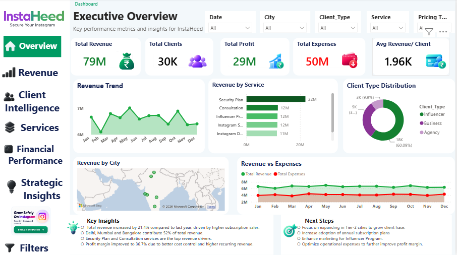
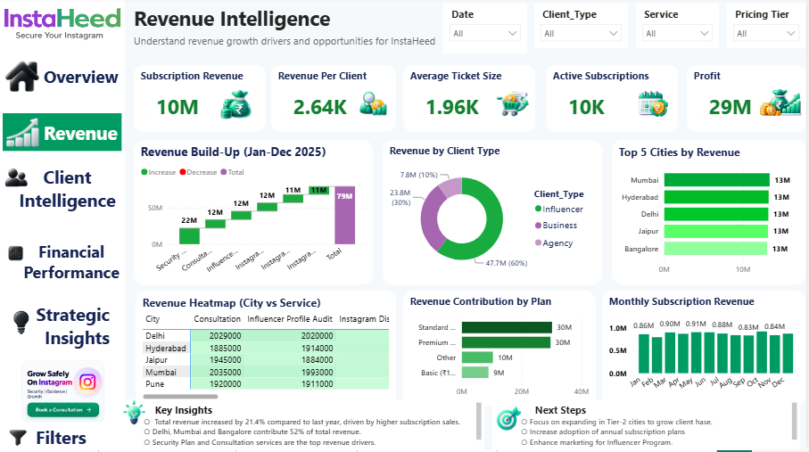
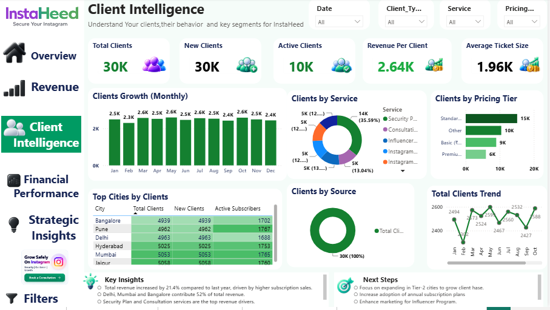
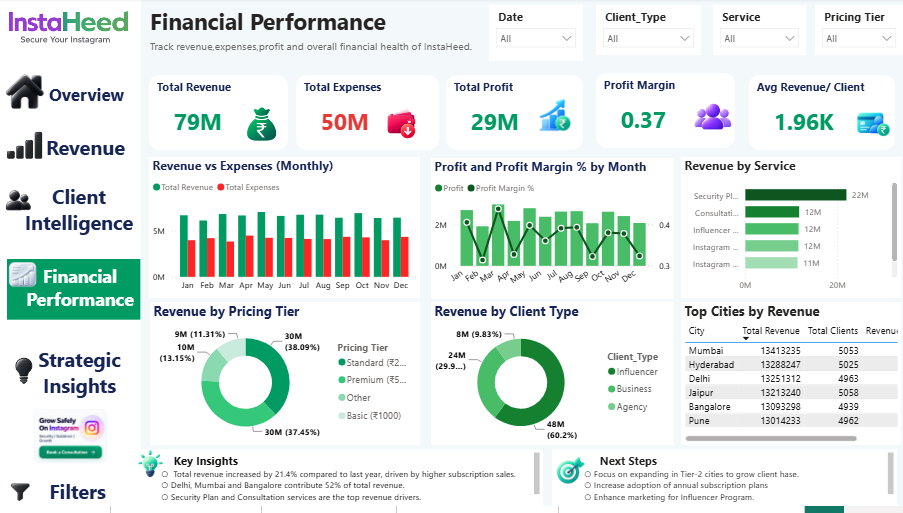
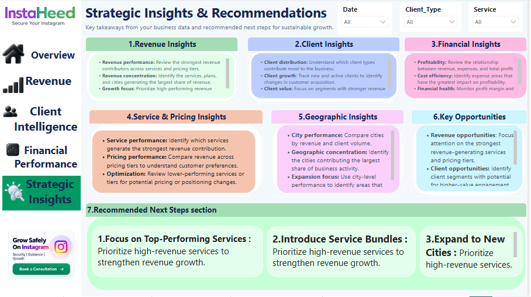

# InstaHeed Power BI Dashboard

> A 5-page Power BI Business Intelligence dashboard designed to analyze revenue performance, client behavior, financial health, and strategic opportunities for InstaHeed.

## 📊 Project Overview

The InstaHeed Power BI Dashboard provides a consolidated view of business performance through interactive reports and KPI-driven analysis.

The dashboard is structured into five analytical pages, moving from high-level executive performance to detailed revenue, client, financial, and strategic analysis.

## 🎯 Business Objectives

- Monitor overall revenue, expenses, profit, and client performance
- Analyze revenue across services, pricing tiers, client types, and cities
- Understand client growth and active client segments
- Evaluate financial performance and profit margin
- Identify business opportunities from revenue and client patterns
- Convert business data into actionable strategic insights

## 📑 Dashboard Pages

### 1. Executive Overview

Provides a high-level summary of InstaHeed's business performance.

**Key areas:**
- Total Revenue
- Total Clients
- Total Profit
- Total Expenses
- Average Revenue per Client
- Revenue Trend
- Revenue by Service
- Client Type Distribution
- Revenue by City
- Revenue vs Expenses
- Key Insights and Next Steps

---

### 2. Revenue Intelligence

Focuses on understanding revenue streams, revenue contribution, and subscription performance.

**Key areas:**
- Subscription Revenue
- Revenue Per Client
- Average Ticket Size
- Active Subscriptions
- Profit
- Revenue Build-Up
- Revenue by Client Type
- Top Cities by Revenue
- Revenue Heatmap by City and Service
- Revenue Contribution by Plan
- Monthly Subscription Revenue

---

### 3. Client Intelligence

Analyzes client growth, segmentation, pricing tiers, service distribution, and geographic client concentration.

**Key areas:**
- Total Clients
- New Clients
- Active Clients
- Revenue Per Client
- Average Ticket Size
- Monthly Client Growth
- Clients by Service
- Clients by Pricing Tier
- Top Cities by Clients
- Clients by Source
- Total Clients Trend

---

### 4. Financial Performance

Provides a consolidated view of revenue, expenses, profit, and financial performance.

**Key areas:**
- Total Revenue
- Total Expenses
- Total Profit
- Profit Margin
- Average Revenue per Client
- Monthly Revenue vs Expenses
- Profit and Profit Margin Trend
- Revenue by Service
- Revenue by Pricing Tier
- Revenue by Client Type
- Top Cities by Revenue

---

### 5. Strategic Insights & Recommendations

Transforms the analytical findings into business-focused insights and recommended actions.

**Key areas:**
- Revenue Insights
- Client Insights
- Financial Insights
- Service & Pricing Insights
- Geographic Insights
- Key Opportunities
- Recommended Next Steps

## 🛠️ Tools & Technologies

- **Microsoft Power BI**
- **Power Query**
- **DAX**
- **Data Modeling**
- **Interactive Slicers & Filters**
- **Data Visualization**
- **Business Intelligence & KPI Analysis**

## 📈 Key Analytical Areas

The dashboard provides analysis across:

- Revenue performance
- Client acquisition and growth
- Service performance
- Pricing tier performance
- Client segmentation
- Geographic performance
- Expense and profit analysis
- Subscription performance
- Strategic business opportunities

## 💡 Key Skills Demonstrated

This project demonstrates practical experience in:

- Data analysis
- Business intelligence
- KPI development
- Dashboard design
- Data visualization
- DAX-based calculations
- Power Query transformation
- Data modeling
- Interactive reporting
- Business-focused storytelling
- Turning data into actionable insights

## 📁 Project Files

| File | Description |
|---|---|
| `01-Executive-Overview.PNG` | Executive dashboard |
| `02-Revenue-Intelligence.PNG` | Revenue analysis dashboard |
| `03-Client-Intelligence.PNG` | Client analysis dashboard |
| `04-Financial-Performance.PNG` | Financial performance dashboard |
| `05-Strategic-Insights.PNG` | Strategic insights dashboard |
| `InstaHeed Project by Vikrant.pbix` | Power BI source file |

## 👤 Author

**Vikrant Kumar**

Data Analyst | Business Intelligence | Power BI

[LinkedIn](https://www.linkedin.com/in/vikrant-kumar-9a35b83a9)

---

⭐ If you find this project useful, feel free to explore the dashboard screenshots and project files.
